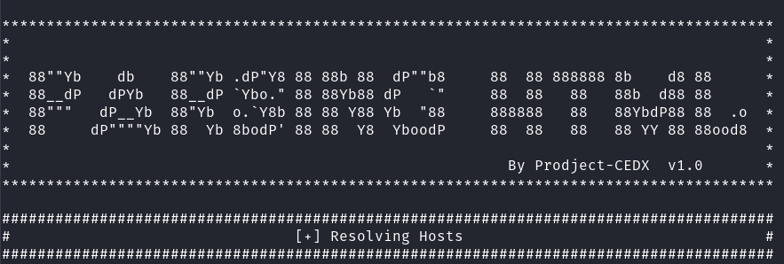

# Script que busca sobdominios a partir de uma url principal.

### Modo de uso:
```shell
$ chmod +x script.sh
```

#### Passando uma url como Parametro

```shell
$ ./script.sh URL
```
<br>



### **São Salvos 2 arquivos no diretório do script um contendo os "IPs" e outro com os SubDominíos encontrados "Hosts"**